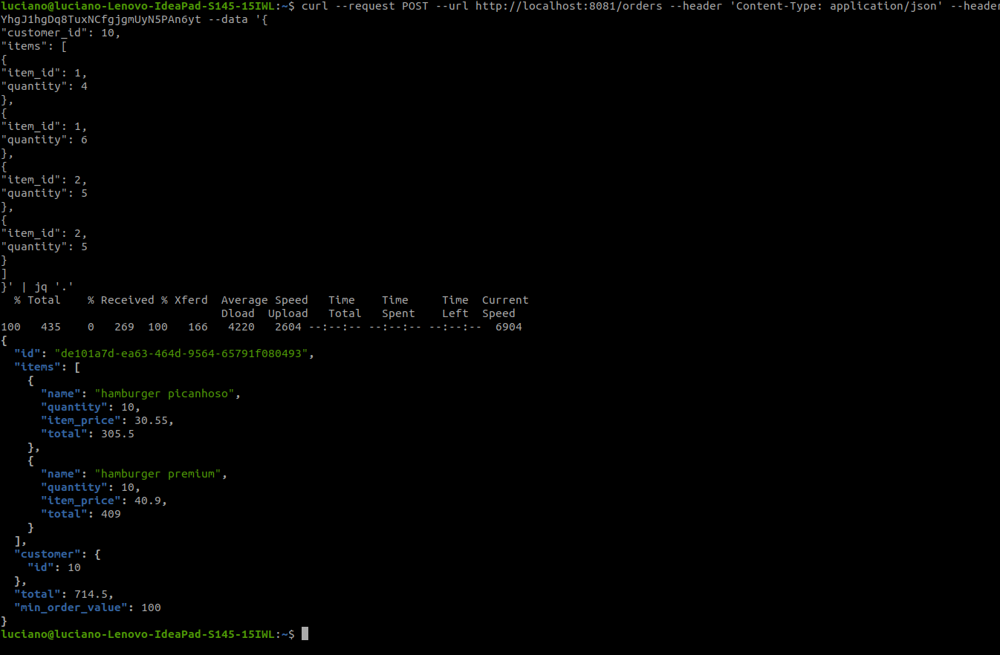
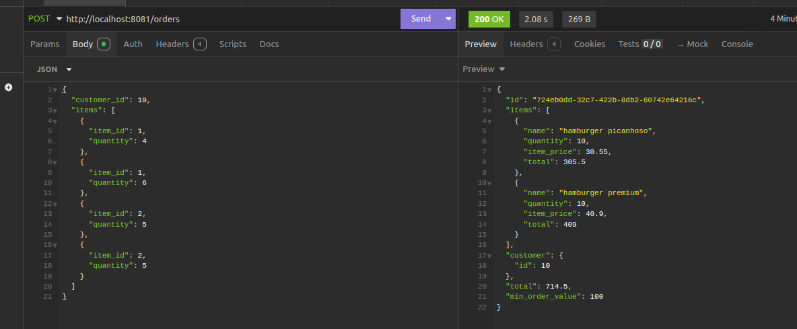

# orders

### Running:
# To start the application, ensure you are in the same directory as the `docker-compose.yml` file.
# Then, execute the following command to run the services in detached mode:
docker compose up -d

### Testing:

curl --request POST \
--url http://localhost:8081/orders \
--header 'Content-Type: application/json' \
--header 'User-Agent: insomnia/10.0.0' \
--cookie JSESSIONID=4f80Peu75gYhgJ1hgDq8TuxNCfgjgmUyN5PAn6yt \
--data '{
"customer_id": 10,
"items": [
{
"item_id": 1,
"quantity": 4
},
{
"item_id": 1,
"quantity": 6
},
{
"item_id": 2,
"quantity": 5
},
{
"item_id": 2,
"quantity": 5
}
]
}'

with the above curl command you're going to have this output:

or import the curl into insomnia and have the bellow output
